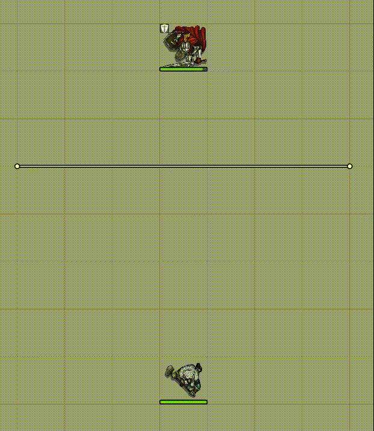

# Wall Height

Adds the ability to set wall height for walls so that tokens can look over them (or under them).

The top and bottom heights of the walls are configurable in the wall configuration dialog.

## Compatibility

This module is likely incompatible with modules which modify token vision. Confirmed incompatible with the Haste module for now.

## License

Licensed under the GPLv3 License (see [LICENSE](LICENSE)).
